# Hand to Excalidraw — Walkthrough

## What Was Built

A full-stack app that converts photos of hand-drawn flowcharts into `.excalidraw` files using **Qwen2.5-VL** AI.

```mermaid
graph LR
    A["📸 Photo Upload"] --> B["🐍 FastAPI"]
    B --> C["🤖 Qwen2.5-VL"]
    C --> D["📐 Structured JSON"]
    D --> E["🔧 Excalidraw Builder"]
    E --> F["📄 .excalidraw"]
```



## Files Created

### Backend (`app/`)
| File | Purpose |
|------|---------|
| [vision.py](file:///Users/nonu/Workspace/REPOSITORIES/hand-to-excalidraw/app/vision.py) | Sends image to Qwen2.5-VL, extracts shapes/text/arrows as JSON |
| [excalidraw_builder.py](file:///Users/nonu/Workspace/REPOSITORIES/hand-to-excalidraw/app/excalidraw_builder.py) | Converts structured data → valid Excalidraw JSON with bindings |
| [server.py](file:///Users/nonu/Workspace/REPOSITORIES/hand-to-excalidraw/app/server.py) | FastAPI with `POST /api/convert` endpoint |
| [cli.py](file:///Users/nonu/Workspace/REPOSITORIES/hand-to-excalidraw/app/cli.py) | CLI: `python -m app.cli photo.jpg -o out.excalidraw` |

### Frontend (`frontend/src/`)
| File | Purpose |
|------|---------|
| [App.jsx](file:///Users/nonu/Workspace/REPOSITORIES/hand-to-excalidraw/frontend/src/App.jsx) | State machine: idle → preview → processing → done/error |
| [UploadZone.jsx](file:///Users/nonu/Workspace/REPOSITORIES/hand-to-excalidraw/frontend/src/components/UploadZone.jsx) | Drag-and-drop + click-to-upload |
| [ResultPanel.jsx](file:///Users/nonu/Workspace/REPOSITORIES/hand-to-excalidraw/frontend/src/components/ResultPanel.jsx) | Download `.excalidraw` + open Excalidraw |
| [index.css](file:///Users/nonu/Workspace/REPOSITORIES/hand-to-excalidraw/frontend/src/index.css) | Dark glassmorphic theme with animations |

### Config
| File | Purpose |
|------|---------|
| [pyproject.toml](file:///Users/nonu/Workspace/REPOSITORIES/hand-to-excalidraw/pyproject.toml) | Python project with FastAPI, huggingface-hub deps |
| [.env.example](file:///Users/nonu/Workspace/REPOSITORIES/hand-to-excalidraw/.env.example) | Template for HF API token + model config |
| [README.md](file:///Users/nonu/Workspace/REPOSITORIES/hand-to-excalidraw/README.md) | Setup & usage instructions |

## UI Preview


## How to Run

```bash
# Backend (terminal 1)
conda activate hand_to_excalidraw
cp .env.example .env   # add your HF token
uvicorn app.server:app --reload --port 8000

# Frontend (terminal 2)
cd frontend && npm run dev
```

Open **http://localhost:5173** → upload a flowchart photo → download the `.excalidraw` file → open at [excalidraw.com](https://excalidraw.com).

## What's Next

To fully test end-to-end, you'll need to:
1. Add your HuggingFace API token to `.env`
2. Upload a real flowchart image through the web UI or CLI
3. Open the generated `.excalidraw` file in Excalidraw to verify
